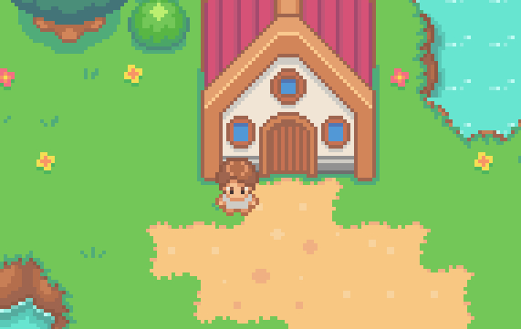
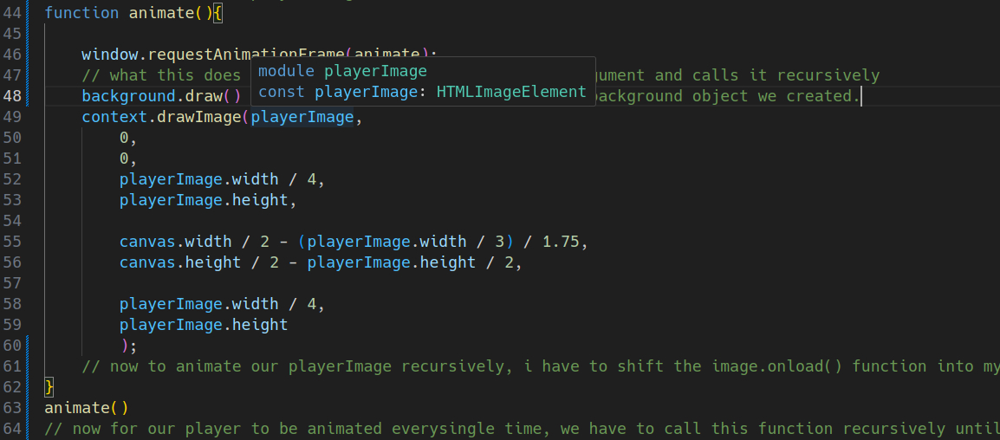
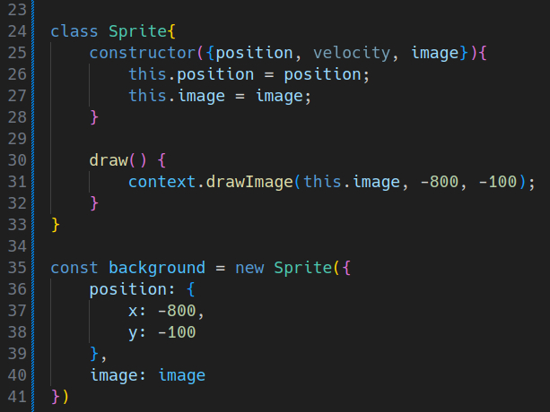
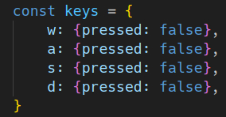
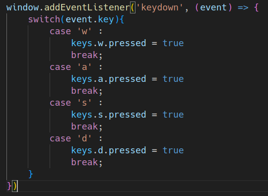
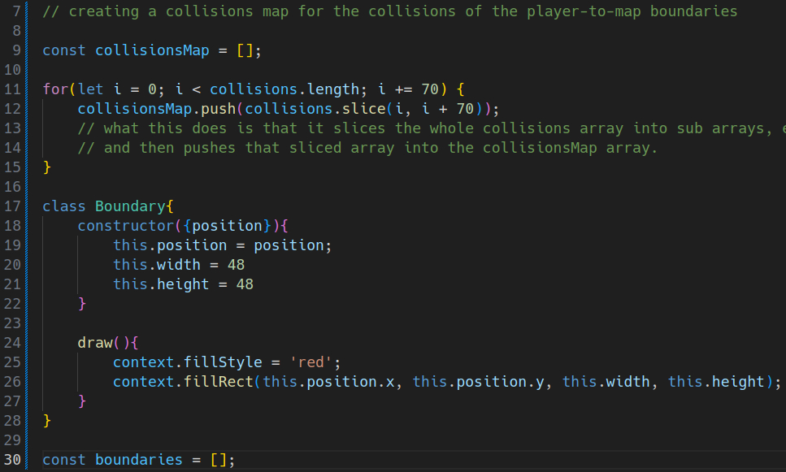
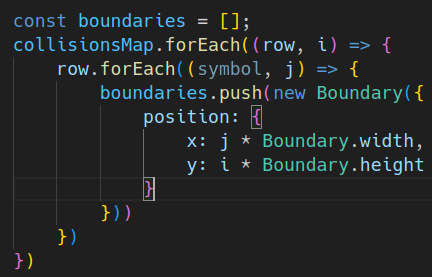
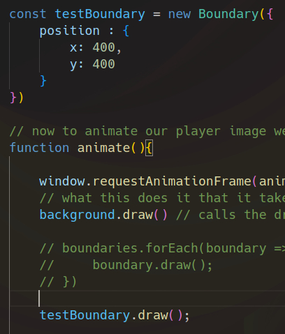

<h1>Game-Dev Documentation</h1>

<section>
<h3><b>Day - 1 (4-11-25) : </b></h3>
This is me starting to work on this project and this is the code i've written and understood so far from the lecture, i'll try to document it down to keep track of my progress and changes.

From the beginning i first initialised our canvas and my context window, context window is set to be '2d' because that was what i needed for this game and the canvas for the game to be played on.

In `line 4 - 5`  i set the width and height for the desired canvas, the reason i set it to be `1024 x 576` is because that size can be rendered perfectly for each and most of the screens (if i publish it publicly some day)

Moving forward to the `lines 8 - 9` where i set the `fillStyle` to be equal to white so that it would be visible on my black background viewport ( i have currently set the background of the live preview to be black as suggested in the lecture )

Moving on the the `line 12 - 13` where i was told to make a object of `Image()` as it allows me to import my `game_map.png` as a html's `` element into my javascript file to be used later. And in the next line the src is set to the destination folder of that map image.

and lastly, well for context :
<ul><li>That `context.drawImage(image, 0, 0);  was written in line 15 - 16 outside of the arrow function, but the error i was facing was that the image was not loading on refreshing the page, the reason behind that was that the size of the image was not allowing the image to be loaded as quickly as the rest of the page</li></ul>

So that's why i had to use the `onload` method and make it an arrow function so that the image would be loaded directly whenever i reload my page.

That is it for the Day - 1.
</section>

<section>
<h3><b>Day - 2 (11-11-25) : </b></h3>idk where i was for the last 7 days, so i just started working on this project again and this time i am working on rendering my player image.

this was the program i had just written :

so the issue i am facing with this is that the player image is relatively smaller than my map and what this leads to is pre rendering of our image and then on top of it, it renders our map so our player image gets overdrawn and causes to not be visible in the viewport. just thought i should document this.

<b>The fix :</b>

what this does is that it renders our map and player image at the same time and also i have shifted the playerImage variable on top of our arrow function.

<b>Player Image Cropping and Position Set :</b>

As you can see i have added some new parameters inside the drawImage function for the playerImage,
<ul>
    <li>
        First the 4 new parameters are for the X and Y co-ordinates and for their respective limits : 
            <ul>
                <li>First one represents the x coordinate i want to begin the cropping from the left hand side</li>
                <li>Second is for the Y coordinate i want to begin the cropping from, top</li>
                <li>Third one sets the limit for the cropping till the point where we want</li>
                <li>vice versa for the height, limit for the total height of the rendered image</li>
            </ul>
    </li>
    <li>
        Then as you can see the last 4 parameters are actually the real co-ordinates of our player image which tells us where our image is going to be rendered at.
        The first two parameters are the X and Y Co-ordinates of the position of the rendered image.
    </li>
</ul>
</section>

<section>
<h3><b>Day - 3 (12-11-25) : </b></h3>
The last day i stopped after the cropping part of the playerImage. And after the last changes the issue we have is this

the player is not being rendered in the center of our canvas which is not good.

<b>The fix : </b> We gotta divide the X position co-ordinate of our image by a number like 4 or 3 and divide the overall value by value near by 2 so that it would move a little closer to the center. By far i did wrote this

line 24 - canvas.width / 2 - (playerImage.width / 3) / 1.75

<b>Continuation of Day 3 -</b>
So the changes i have made so far are :

initialised a function named 'animate()' which is responsible for the animation of our playerImage while playing the game.

shifted the entire content of the image.onload() function into this animate function.

the window.requestAnimationFrame() method just takes the animate() function itself as an argument and calls it recursively.

and after that i have initialised a class :

this draws our background image so that we can animate it later, one of the reasons i made this class was because we are gonna have to animate the background later in the game too when a player is moving across the screen and in order to do that i gotta have the X and Y position values stored in a variable that i can manipulate later and not constants.

Moving on to assiging listeners to the key downs of a player and in order to do that i initialised a object named 'Keys' which holds the values of different keys pressed by an player in order to move around the map.

    
    
    

and now using the eventListener the pressed property of each key gets changed to be true. The reason there are two event listeners is that the first one listens to the keydowns of the keyboard and sets the value for the key being pressed at the moment to be true, but the issue with that is that now the key pressed property is set to be true for the whole time, even when the player is not pressing the key. So then comes in the second eventListener which listens to the keyups from the keyboard and set the pressed property of the key which is not being pressed now to be false.

So far now the player is moving across the map using keyboard keys. Next i gotta work on the object collissions of the player with map objects.

alright so a little issue i can face is that if i press a key while already holding another key, like :
    if i am pressing s and then i pressed d without letting go of s, it does not listens to the d-key that i just pressed it keeps moving in the s-key direction. So in order to fix that i gotta add a listener that registers the last key that is pressed.

<h2>Collissions :</h2>

by far what i have done is that i have exported my game_map file from TILED as an JSON into my project and from there i have imported the collisions array and sliced it into sub arrays, each containing 70 elements in it.

and then i have initialised a class named Boundary, which draws red boxes (boundary) over our map, the constructor inside it assigns the values of the position of the boundary box and it's width and height. And then the draw() function is supposed to draw those boxes on the map.

so what this does is that it that it loops over the collisionsMap array and for each of the element inside the array (which is the sub array of 70 elements) it again loops over that row.
And for each row i push the element inside the boundaries array which creates a new boundary everytime and the position for the constructor is set to be the x and y coordinate to be multiplied into the Boundary width and height. Which are set to be static variables in the boundary class so that we can manipulate them later and avoid multiplying by a constant.

but the issue with this is that if we console log the boundaries array we can see at least 2800 elements inside it, what that means is that the whole map se being rendered again which is not good, what we want is that the boundary to be rendered at the points where the value is equals to 1025 (value for collision in collisions array)

to fix this i just added an if condition inside the row.forEach() which pushes a element into the boundaries array only when the symbol is equal to 1025.
</section>

<section>
<h3><b>Day - 4 (16-11-25) : </b></h3>

Began working again on this project and today the goal is to finish off collisions of player-to-map boundaries and till now i have created a testBoundary element, 400 x 400 pixels, that is placed on our map to check for collisions instaed of rendering out the whole boundary array.

<h3>Output : </h3>

Now when i was moving the player, the boundary block was also moving along with the player and to fix that what i did was, that i modified the if block for the eventListener of the player movement block.
and added a line which also changes the x and y of the boundary block along with the background.

</section>