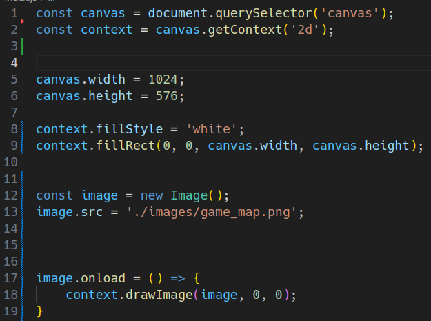
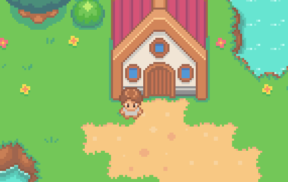

<h1>Game-Dev Documentation</h1>

<section>
<h3><b>Day - 1 (4-11-25) : </b></h3>
This is me starting to work on this project and this is the code i've written and understood so far from the lecture, i'll try to document it down to keep track of my progress and changes.

From the beginning i first initialised our canvas and my context window, context window is set to be '2d' because that was what i needed for this game and the canvas for the game to be played on.

In `line 4 - 5`  i set the width and height for the desired canvas, the reason i set it to be `1024 x 576` is because that size can be rendered perfectly for each and most of the screens (if i publish it publicly some day)

Moving forward to the `lines 8 - 9` where i set the `fillStyle` to be equal to white so that it would be visible on my black background viewport ( i have currently set the background of the live preview to be black as suggested in the lecture )

Moving on the the `line 12 - 13` where i was told to make a object of `Image()` as it allows me to import my `game_map.png` as a html's `` element into my javascript file to be used later. And in the next line the src is set to the destination folder of that map image.

and lastly, well for context :
<ul><li>That `context.drawImage(image, 0, 0);  was written in line 15 - 16 outside of the arrow function, but the error i was facing was that the image was not loading on refreshing the page, the reason behind that was that the size of the image was not allowing the image to be loaded as quickly as the rest of the page</li></ul>

So that's why i had to use the `onload` method and make it an arrow function so that the image would be loaded directly whenever i reload my page.

That is it for the Day - 1.
</section>

<section>
<h3><b>Day - 2 (11-11-25) : </b></h3>idk where i was for the last 7 days, so i just started working on this project again and this time i am working on rendering my player image.

this was the program i had just written :

so the issue i am facing with this is that the player image is relatively smaller than my map and what this leads to is pre rendering of our image and then on top of it, it renders our map so our player image gets overdrawn and causes to not be visible in the viewport. just thought i should document this.

<b>The fix :</b>

what this does is that it renders our map and player image at the same time and also i have shifted the playerImage variable on top of our arrow function.

<b>Player Image Cropping and Position Set :</b>

As you can see i have added some new parameters inside the drawImage function for the playerImage,
<ul>
    <li>
        First the 4 new parameters are for the X and Y co-ordinates and for their respective limits : 
            <ul>
                <li>First one represents the x coordinate i want to begin the cropping from the left hand side</li>
                <li>Second is for the Y coordinate i want to begin the cropping from, top</li>
                <li>Third one sets the limit for the cropping till the point where we want</li>
                <li>vice versa for the height, limit for the total height of the rendered image</li>
            </ul>
    </li>
    <li>
        Then as you can see two new parameters which includes
    </li>
</ul>
</section>